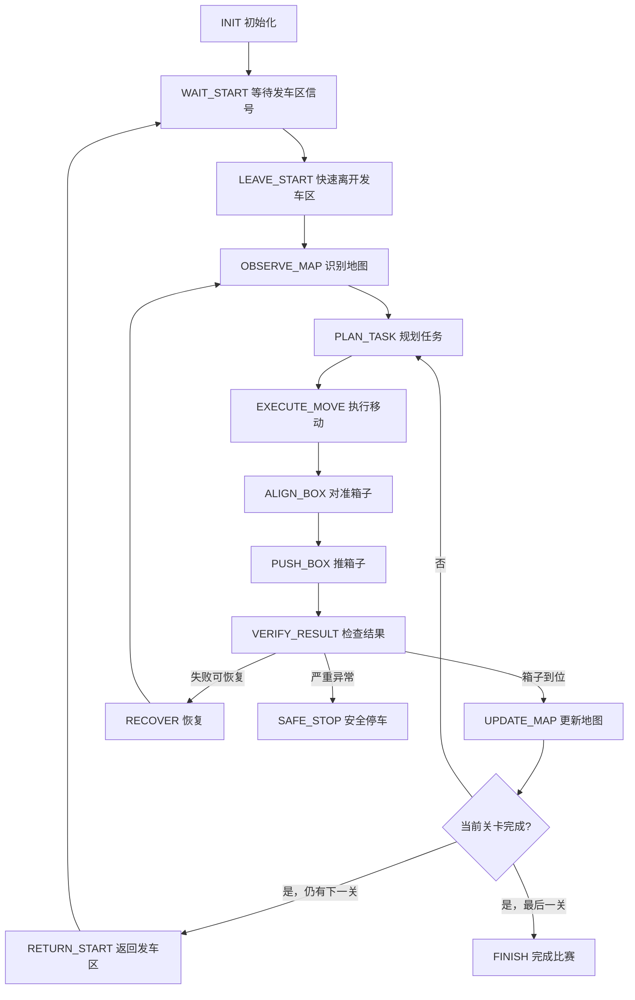

# 人工智能视觉组比赛状态机

本文档定义第一版比赛状态机，用于后续拆分为路径规划、底盘控制、视觉识别和测试任务。

## 设计目标

- 先保证完整跑通纯推箱子关卡，再扩展分类、炸弹和连续关卡。
- 所有关键动作都通过状态切换管理，避免比赛现场靠临时判断。
- 支持连续关卡：进入连续比赛后，中途不依赖人工干预或重新烧录程序。
- 支持失败恢复：推箱子失败、定位偏差、识别丢失时能停下并重新规划。

## 总流程



## 状态定义

| 状态 | 目的 | 进入条件 | 退出条件 |
|---|---|---|---|
| `INIT` | 初始化硬件、参数、地图缓存和状态变量 | 上电或程序启动 | 初始化成功 |
| `WAIT_START` | 在发车区等待系统开始 | 已初始化或上一关结束 | 检测到允许出发 |
| `LEAVE_START` | 快速离开发车区，避免停留 3 秒触发重置 | 开始信号有效 | 离开发车区安全距离 |
| `OBSERVE_MAP` | 从视觉结果生成 16x12 地图 | 已离开发车区或恢复后 | 地图可信度达标 |
| `PLAN_TASK` | 选择箱子、目标点并生成路径 | 地图已识别 | 得到动作序列 |
| `EXECUTE_MOVE` | 移动到推箱子的预备位置 | 已生成路径 | 到达目标栅格附近 |
| `ALIGN_BOX` | 对准箱子和推动方向 | 到达预备位置 | 角度和位置误差达标 |
| `PUSH_BOX` | 低速稳定推动箱子 | 已对准 | 推动距离完成或检测到失败 |
| `VERIFY_RESULT` | 判断箱子是否到位、消失或偏离 | 推动结束 | 成功、可恢复失败或严重异常 |
| `UPDATE_MAP` | 更新箱子、目标点、障碍物状态 | 推动成功 | 地图状态更新完成 |
| `RECOVER` | 后退、重新定位、重新规划 | 可恢复失败 | 恢复动作完成 |
| `RETURN_START` | 当前关卡完成后返回发车区 | 非最后关完成 | 进入发车区并等待下一关 |
| `FINISH` | 比赛结束，停止计时相关动作 | 最后一关完成 | 停车 |
| `SAFE_STOP` | 避免失控或越界 | 严重异常 | 人工处理或重新开始 |

## 核心状态变量

```c
typedef enum {
    STATE_INIT = 0,
    STATE_WAIT_START,
    STATE_LEAVE_START,
    STATE_OBSERVE_MAP,
    STATE_PLAN_TASK,
    STATE_EXECUTE_MOVE,
    STATE_ALIGN_BOX,
    STATE_PUSH_BOX,
    STATE_VERIFY_RESULT,
    STATE_UPDATE_MAP,
    STATE_RECOVER,
    STATE_RETURN_START,
    STATE_FINISH,
    STATE_SAFE_STOP
} RaceState;

typedef struct {
    int row;
    int col;
} GridPos;

typedef enum {
    CELL_EMPTY = 0,
    CELL_WALL,
    CELL_BOX,
    CELL_TARGET,
    CELL_BOMB,
    CELL_START,
    CELL_UNKNOWN
} CellType;

typedef struct {
    CellType cell[12][16];
    GridPos car;
    float car_theta;
    int current_level;
    int boxes_remaining;
    int map_confidence;
} RaceContext;
```

## 控制接口草案

后续你负责把路径规划和底盘控制接到这些接口上。接口先固定，内部实现可以逐步替换。

```c
bool vision_update_map(RaceContext *ctx);
bool planner_make_plan(const RaceContext *ctx);
bool motion_move_to(GridPos target, float theta);
bool motion_align_to_box(GridPos box, int push_dir);
bool motion_push_box(int push_dir);
bool verify_push_result(RaceContext *ctx);
void motion_stop(void);
void recover_backoff_and_relocalize(RaceContext *ctx);
```

## 第一版切换规则

| 当前状态 | 判断 | 下一状态 |
|---|---|---|
| `INIT` | 初始化成功 | `WAIT_START` |
| `WAIT_START` | 检测到开始信号 | `LEAVE_START` |
| `LEAVE_START` | 已离开发车区 | `OBSERVE_MAP` |
| `OBSERVE_MAP` | 地图可信度足够 | `PLAN_TASK` |
| `OBSERVE_MAP` | 地图可信度不足 | `RECOVER` |
| `PLAN_TASK` | 有可执行计划 | `EXECUTE_MOVE` |
| `PLAN_TASK` | 无可执行计划 | `RECOVER` |
| `EXECUTE_MOVE` | 到达推箱预备位 | `ALIGN_BOX` |
| `EXECUTE_MOVE` | 定位丢失或偏差过大 | `RECOVER` |
| `ALIGN_BOX` | 对准完成 | `PUSH_BOX` |
| `ALIGN_BOX` | 对准失败 | `RECOVER` |
| `PUSH_BOX` | 推动动作结束 | `VERIFY_RESULT` |
| `VERIFY_RESULT` | 箱子到位或消失 | `UPDATE_MAP` |
| `VERIFY_RESULT` | 箱子偏离但可重试 | `RECOVER` |
| `VERIFY_RESULT` | 越界、识别完全丢失 | `SAFE_STOP` |
| `UPDATE_MAP` | 本关未完成 | `PLAN_TASK` |
| `UPDATE_MAP` | 本关完成且有下一关 | `RETURN_START` |
| `UPDATE_MAP` | 最后一关完成 | `FINISH` |
| `RETURN_START` | 回到发车区 | `WAIT_START` |

## 现场风险和处理

| 风险 | 处理策略 |
|---|---|
| 发车区停留超过 3 秒导致重置 | 开始后先执行固定快速离开发车区动作，再进入识别和规划 |
| 视觉延迟导致车位不准 | 控制速度先保守，关键推箱动作前重新定位 |
| 标识牌高度导致定位偏差 | 机械组固定 15 cm 高度，并在测试记录中标定偏差 |
| 屏幕反光或亮斑影响识别 | 测试偏振片、亮度、白平衡和 HSV 阈值组合 |
| 箱子推偏 | 后退固定距离，重新对准，再次低速推动 |
| 地图比训练复杂 | 规划器必须支持重新规划，不写死地图路径 |

## 本周验收标准

- 能用文本地图模拟一轮状态流转。
- 能从 `OBSERVE_MAP` 进入 `PLAN_TASK` 并输出下一步动作。
- 能人工构造“推箱失败”场景，状态机进入 `RECOVER`，再回到 `OBSERVE_MAP`。
- 状态名、接口名和地图结构保持稳定，方便三个人分工并行。

## 下一步任务

1. 写一个 PC 端文本地图模拟器。
2. 实现纯推箱子 BFS 规划原型。
3. 把规划输出转换成 `move_to`、`align_to_box`、`push_box` 三类动作。
